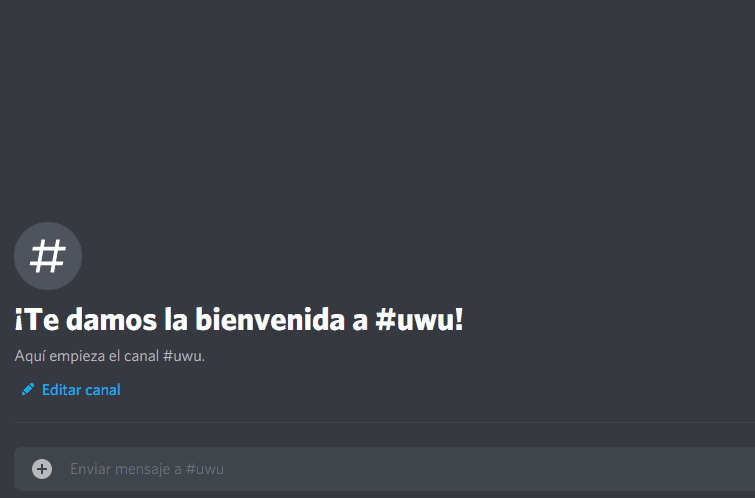

<h1 align="center">Furbot</h1>

    

Bot para el servidor de Villafurrense

# Ejecución en docker-compose (recomendado):
- Descargar el archivo docker-compose y cambiar las rutas de los volúmenes
- En la carpeta que corresponde al volumen /bot/env colocar el archivo furbot.env rellenando los tokens 
- `docker-compose up -d`

# Ejecución sin docker
- Clonar el repositorio
- Rellenar el archivo env/furbot.env con los tokens
- `python3 src/main.py`

## Demo

